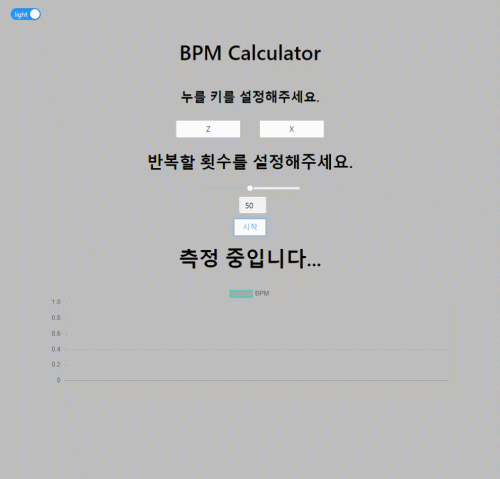
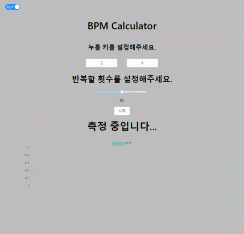

# BPM Calculator
두 개의 키를 지정하여 얼마나 빠르게 키를 누를 수 있는지 측정할 수 있습니다.

# Feature

## BPM 측정

각 버튼을 눌렀을 때의 평균 BPM을 그래프로 확인할 수 있습니다.

## Dark mode

좌측 상단의 스위치 버튼을 이용하여 다크 모드를 적용할 수 있습니다.

# Tech Stack
- [chart.js][chart]
- [react-chartjs-2][react_chart]
- [ant design][ant_design]

[chart]: https://github.com/chartjs/Chart.js
[react_chart]: https://github.com/reactchartjs/react-chartjs-2
[ant_design]: https://ant.design/
